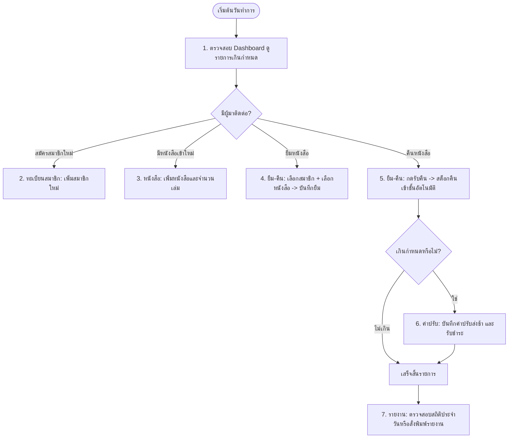

# คู่มือระบบบริหารจัดการห้องสมุด (Library Management System) — ฉบับผู้ใช้งานและภาพรวมระบบ (README 2)

---

## 📌 1. จุดประสงค์ของเว็บไซต์ (Website Purpose)

เว็บไซต์ **ระบบบริหารจัดการห้องสมุด (Library Management System)** พัฒนาขึ้นเพื่อเป็นแพลตฟอร์มบริหารจัดการทรัพยากรห้องสมุดแบบดิจิทัลครบวงจรสำหรับบรรณารักษ์และเจ้าหน้าที่ห้องสมุด โดยเปลี่ยนผ่านจากรูปแบบเดิม (การจดสมุดบันทึก, ไฟล์สเปรดชีตที่อัปเดตยาก หรือระบบหน้าเว็บเดิมที่บันทึกข้อมูลเฉพาะในเบราว์เซอร์เครื่องเดียว) ให้กลายเป็น **ระบบศูนย์กลาง (Centralized Web Application)** ที่ทำงานได้แบบเรียลไทม์

### ปัญหาที่ระบบเข้ามาแก้ไข
* **ข้อมูลไม่ตรงกันและสูญหาย:** จากการจดบันทึกด้วยมือหรือต่างคนต่างบันทึก
* **ไม่ทราบสถานะหนังสือแบบเรียลไทม์:** ไม่รู้ว่าหนังสือเล่มไหนอยู่บนชั้น หรือมีใครยืมไปเมื่อใด
* **คำนวณวันส่งคืนและค่าปรับผิดพลาด:** การนับวันยืมและการคิดค่าปรับล่าช้ามีความคลาดเคลื่อน
* **ขาดการสรุปสถิติเพื่อวางแผน:** บรรณารักษ์ไม่เห็นแนวโน้มการใช้งานหมวดหมู่หนังสือเพื่อจัดซื้อเพิ่มเติม

---

## 🎯 2. เพื่ออะไร (Why / Core Benefits)

ระบบนี้สร้างขึ้นมาเพื่อมอบคุณค่าและประโยชน์ต่อการดำเนินงานของห้องสมุดในมิติต่าง ๆ ดังนี้:

| มิติ | คุณค่าที่ได้รับ |
|---|---|
| **ลดภาระงานและเวลา (Efficiency)** | ลดขั้นตอนการทำงานเอกสาร เจ้าหน้าที่ค้นหาหนังสือและทำรายการยืม-คืนได้ในไม่กี่คลิก |
| **ความแม่นยำของสต็อก (Accuracy)** | ระบบตัดยอดหนังสือที่พร้อมให้ยืม (Available) และคืนสต็อกกลับเข้าสู่ระบบโดยอัตโนมัติทันทีที่บันทึกการส่งคืน |
| **ติดตามและควบคุมได้ (Traceability)** | ตรวจสอบย้อนหลังได้ชัดเจนว่าสมาชิกคนใดยืมหนังสือเล่มใด มีหนังสือใดที่เกินกำหนดส่ง และค้างชำระค่าปรับเท่าใด |
| **โปร่งใสในการเงิน (Financial Transparency)** | บันทึกรายการค่าปรับและสถานะการชำระเงินอย่างเป็นระบบ ป้องกันข้อผิดพลาดในการรับเงินค่าปรับ |
| **วางแผนพัฒนาห้องสมุด (Data-Driven Decision)** | มีกราฟและรายงานสรุปสัดส่วนหนังสือและอัตราการส่งคืน ช่วยให้ผู้บริหารห้องสมุดจัดสรรงบประมาณได้อย่างคุ้มค่า |

---

## 💻 3. สร้างด้วยอะไร (Tech Stack & Architecture)

ระบบนี้สร้างขึ้นด้วยสถาปัตยกรรม **Modern Client-Server Architecture** ที่แยกส่วนการแสดงผล (Frontend) และส่วนประมวลผลข้อมูล (Backend) ออกจากกันอย่างเป็นสัดส่วน:

```
┌────────────────────────────────────────────────────────┐
│             FRONTEND (Single Page App)                 │
│   Vue.js 3 + Pinia + Vue Router + Tailwind CSS + Vite  │
└───────────────────────────┬────────────────────────────┘
                            │  HTTP / REST API (JSON)
                            ▼
┌────────────────────────────────────────────────────────┐
│             BACKEND (REST API Server)                  │
│               Node.js + Express.js                     │
└───────────────────────────┬────────────────────────────┘
                            │  Read / Write (fs/promises)
                            ▼
┌────────────────────────────────────────────────────────┐
│             DATABASE STORAGE                           │
│           backend/data/db.json                         │
│  (พร้อมปรับเปลี่ยนเป็น PostgreSQL / MongoDB ในอนาคต)     │
└────────────────────────────────────────────────────────┘
```

### รายละเอียดเทคโนโลยีที่เลือกใช้
* **Frontend (ส่วนติดต่อผู้ใช้งาน):**
  * **Vue.js 3 (Composition API / `<script setup>`):** จัดการหน้าเว็บและสถานะการโต้ตอบที่ลื่นไหลแบบ Single Page Application
  * **Vite:** เครื่องมือ Bundle และ Dev Server ความเร็วสูง รองรับ Hot Module Replacement
  * **Pinia:** คลังจัดการสถานะส่วนกลาง (Global State Management) ซิงก์ข้อมูลระหว่างหน้าต่าง ๆ
  * **Vue Router 4:** จัดการเปลี่ยนหน้า 7 หน้าการทำงานโดยไม่ต้องโหลดหน้าเว็บใหม่
  * **Tailwind CSS:** ออกแบบ UI ที่สะอาด สวยงาม ทันสมัย และ Responsive รองรับทุกหน้าจอ
  * **Lucide Vue Next:** ชุดไอคอน UI คุณภาพสูง เสริมความเข้าใจและง่ายต่อการใช้งาน
  * **Chart.js:** สร้างกราฟแสดงข้อมูลสถิติห้องสมุด (Doughnut Chart)
  * **Axios:** จัดการส่งคำขอเชื่อมต่อ REST API ไปยัง Backend

* **Backend (เซิร์ฟเวอร์และฐานข้อมูล):**
  * **Node.js & Express.js:** สถาปัตยกรรม RESTful API น้ำหนักเบา ยืดหยุ่น และประมวลผลรวดเร็ว
  * **JSON File Database (`backend/data/db.json`):** จัดเก็บข้อมูลในรูปแบบ JSON file ผ่าน asynchronous file system (`fs/promises`) จัดเก็บข้อมูลถาวร (Persistent) แม้ปิดเซิร์ฟเวอร์ โดยไม่ต้องพึ่งพาเซิร์ฟเวอร์ฐานข้อมูลภายนอกในการทดสอบ

---

## 🚀 4. ทำอย่างไร / การใช้งานแต่ละโมดูล (How to Use)

ระบบแบ่งการทำงานออกเป็น **7 โมดูลหลัก** ที่ครอบคลุมทุกกระบวนการของห้องสมุด:

### 4.1 หน้าหลัก (Dashboard)
* **สรุปตัวชี้วัดสำคัญ (Key Metrics):** จำนวนหนังสือทั้งหมด, จำนวนสมาชิก, จำนวนเล่มที่ถูกยืมออกไป, จำนวนหนังสือที่เกินกำหนดส่ง
* **แถบแจ้งเตือนด่วน:** แสดงวันที่-เวลาปัจจุบัน และลิงก์ด่วนไปยังรายการที่เกินกำหนด
* **ค้นหาหนังสือด่วน:** ช่องค้นหาหนังสือจากชื่อเรื่องหรือผู้แต่ง
* **เพิ่มหนังสือด่วน (Quick Add):** เพิ่มชื่อเรื่อง, ผู้แต่ง, หมวดหมู่ และจำนวนเล่มได้ทันทีจากหน้าแรก
* **ประวัติการยืมล่าสุด:** ตรวจดู 5 รายการยืมล่าสุด พร้อมป้ายสถานะ (กำลังยืม, คืนแล้ว, เกินกำหนด)

### 4.2 จัดการหนังสือ (Books Catalog)
* **ค้นหาและกรองข้อมูล:** ค้นหาด้วยชื่อเรื่อง ผู้แต่ง หรือเลข ISBN และเลือกกรองตามหมวดหมู่ (เช่น คอมพิวเตอร์, วรรณกรรม, วิทยาศาสตร์)
* **แสดงสต็อกคงเหลือ:** บอกจำนวนเล่มทั้งหมด (Total) และจำนวนเล่มที่พร้อมให้ยืม (Available)
* **เพิ่มหนังสือใหม่:** กรอกข้อมูลหนังสือพร้อมระบุจำนวนเล่ม
* **แก้ไขและลบ:** ปรับปรุงข้อมูลหนังสือ หรือลบรายการหนังสือที่ไม่ใช้งานออกจากระบบ

### 4.3 จัดการสมาชิก (Members Management)
* **ทะเบียนสมาชิก:** บันทึกรหัสสมาชิก, ชื่อ-นามสกุล, เบอร์โทรศัพท์ และอีเมล
* **ตรวจสอบสถานะสมาชิก:** ดูสถานะการเป็นสมาชิก (ปกติ / Active, หมดอายุ / Expired, ถูกระงับ / Suspended)
* **เพิ่ม/แก้ไขสมาชิก:** ลงทะเบียนผู้ใช้บริการใหม่ หรืออัปเดตข้อมูลติดต่อ

### 4.4 ยืม-คืนหนังสือ (Borrow & Return)
* **ขั้นตอนการยืม (Borrow Flow):**
  1. กดปุ่ม **"ทำรายการยืม"**
  2. เลือกสมาชิกจากรายชื่อสมาชิกที่สถานะปกติ
  3. เลือกหนังสือที่ต้องการยืม (ระบบจะแสดงเฉพาะเล่มที่คงเหลือ > 0)
  4. ระบบจะคำนวณ **"วันกำหนดส่งคืน"** ให้อัตโนมัติตามนโยบายห้องสมุด (เช่น 14 วัน)
  5. กดยืนยัน ระบบจะตัดสต็อกหนังสือที่พร้อมยืมออก 1 เล่มทันที
* **ขั้นตอนการคืน (Return Flow):**
  1. ค้นหารายการยืมจากรหัสรายการ, ชื่อสมาชิก หรือชื่อหนังสือ
  2. เมื่อผู้ใช้นำหนังสือมาคืน ให้กดปุ่ม **"รับคืน"**
  3. ระบบจะปรับสถานะเป็น "คืนแล้ว" และเพิ่มสต็อกหนังสือกลับเข้าสู่ชั้นหนังสือทันที

### 4.5 จัดการค่าปรับ (Fines Management)
* **ดูรายการค่าปรับ:** แสดงรายชื่อผู้ที่มีค่าปรับ, สาเหตุ (เช่น ส่งคืนช้า, หนังสือชำรุด), จำนวนเงิน และสถานะ (ค้างชำระ / ชำระแล้ว)
* **ออกรายการค่าปรับใหม่:** บันทึกกรณีพบหนังสือชำรุดเสียหายหรือส่งคืนล่าช้า
* **รับชำระเงิน (Mark as Paid):** เมื่อสมาชิกชำระเงินเรียบร้อย กดบันทึกรับเงินเพื่อเปลี่ยนสถานะเป็น "ชำระแล้ว"
* **สรุปยอดเงิน:** แสดงยอดรวมค่าปรับที่ค้างชำระ และยอดรวมค่าปรับที่จัดเก็บได้แล้ว

### 4.6 รายงานและสถิติ (Reports & Analytics)
* **สถิติภาพรวม:** แสดงร้อยละอัตราการคืนหนังสือ (Return Rate %), จำนวนเล่มที่หมุนเวียน
* **กราฟเชิงภาพ:**
  * กราฟโดนัทแสดงสัดส่วนหนังสือแยกตามหมวดหมู่
  * กราฟสัดส่วนสถานะการยืม-คืน
* **พิมพ์รายงาน:** มีปุ่ม **"พิมพ์รายงาน"** จัดหน้าสรุปข้อมูลสำหรับส่งผู้บริหารหรือพิมพ์ลงกระดาษ

### 4.7 ตั้งค่านโยบายและระบบ (Settings)
* **นโยบายการยืม (Library Policy):**
  * กำหนดจำนวนวันยืมสูงสุด (เช่น 14 วัน)
  * กำหนดจำนวนเล่มสูงสุดที่สมาชิกยืมได้พร้อมกัน
  * กำหนดอัตราค่าปรับส่งช้าต่อวัน (เช่น 5 บาท/วัน)
* **ข้อมูลผู้ดูแลระบบ:** ดูและแก้ไขชื่อ-นามสกุล หรือข้อมูลส่วนตัวของเจ้าหน้าที่
* **รีเซ็ตระบบ (Factory Reset):** ปุ่มล้างข้อมูลและคืนค่าระบบกลับสู่ชุดข้อมูลตัวอย่างเริ่มต้น (Default Seed Data)

---

## 🔄 5. สรุปกระบวนการทำงานประจำวัน (Daily Workflow Example)



---

## 📖 สรุปภาพรวมเอกสารในโปรเจกต์
* **[README.md](file:///d:/1Project/Library/README.md):** ข้อมูลเชิงเทคนิค, โครงสร้างโค้ด, คำสั่งติดตั้ง, การรัน Dev Server และ REST API Reference
* **[README_2.md](file:///d:/1Project/Library/README_2.md) (ไฟล์นี้):** จุดประสงค์ของระบบ, ความสำคัญ, คู่มือการใช้งานแต่ละเมนู และภาพรวมสถาปัตยกรรมเทคโนโลยี
